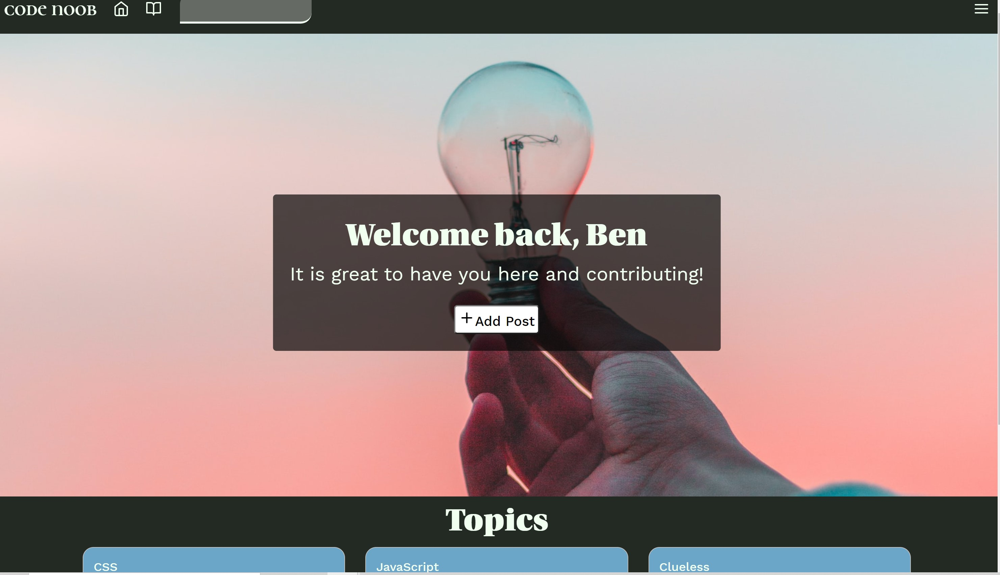
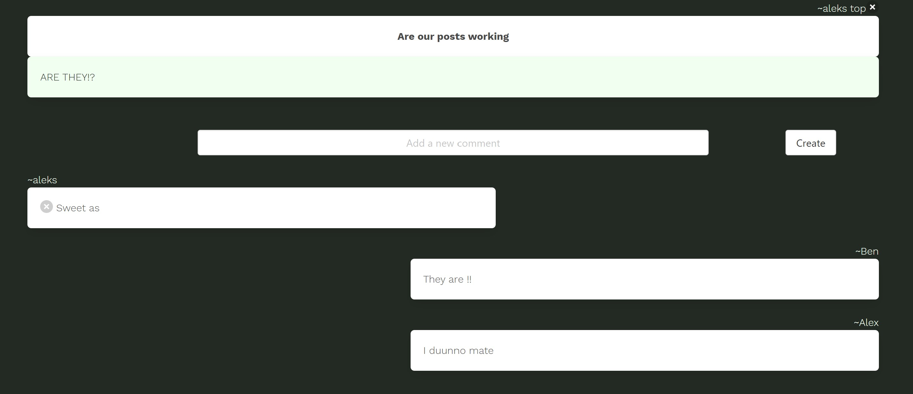
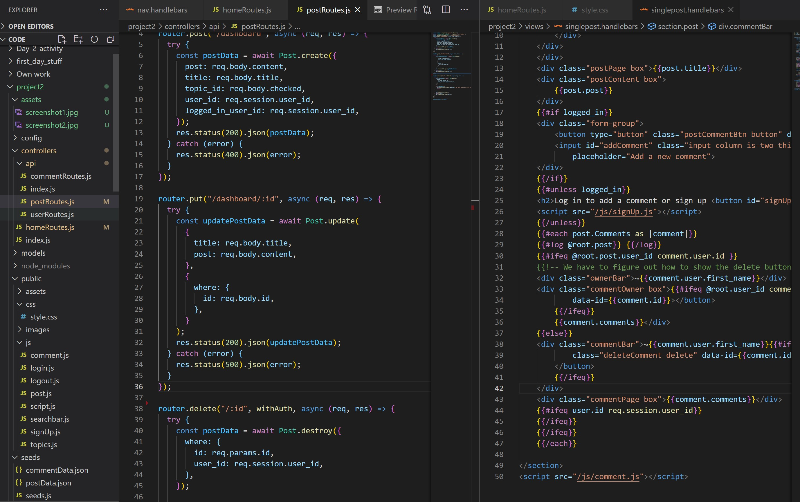

# Code Noob

## Presentation

https://docs.google.com/presentation/d/1y03sEs3EtHdUnEcGY8N8dnFJEMzohKmEYA4UWoE9alw/edit#slide=id.p

## Demo

https://code-noob.herokuapp.com/

## Table of Contents

- [Description](#description)
- [Installation](#installation)
- [Usage](#usage)
- [Contributors](#contributors)
- [Test](#test)
- [Credits](#credits)
- [License](#license)
- [Questions](#questions)

## Description:

Code Noob, is a online forum designed for novice coders as they begin their journey through web development.

## Installation:

    Nil

## Usage:

    The purpose of code noob is to help new developers to connect with their peers, uncover useful ideas and resources so that they can maximise their time working through the inevitable complexities and frustrations that arise in each challenge. We decided to build an application that we would have loved to have access to when we started our own journey in coding, and this forum provided US with incredibly useful experience in building, our first full-stack web application.

The above two images show what the page looks like on our dashboard and post pages. The below image is an exmaple of code written for the application showing the single post html and also our post routes.

## Contributors:

[Ben Cyna](https://github.com/bencyna/)

[Alex Stew](https://github.com/alex-stew)

[Donald Wu](https://github.com/carefree2706)

[Subhash Shrestha](https://github.com/SthaSub)

    , @alex-stew, @SthaSub and @carefree2706

## Test:

    Nil

## Credits:

    All contributors aboves

## License:

      For additional information about the License, click the link below.

- [License](https://opensource.org/licenses/MIT)

## Questions:

      If you have any questions about the Code Noob project, you can follow the link below to navigate to my GitHub page:

- [GitHub Profile](https://github.com/alex-stew bencyna SthaSub donald_wu)

For further information on this project, if you'd like to discuss changes or work together - please reach out directly to: Please contact through the repository.
